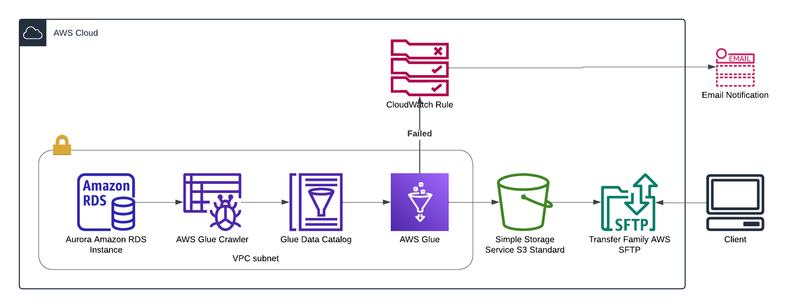

# Bank Group Data Engineering Project

## Overview

This project extracts data from an Amazon Aurora cluster, processes it using AWS Glue, and stores the results in an S3 bucket. The processed data is then made available via an SFTP server.

## Assumptions

- The client wants the file in the format BankName_YYYYMMDD.csv as a single file, not an apache spark partitioned folder.
- The Aurora RDS Postgres database has previously been setup in a subnet which the application has access to.
- For the task some connection details have been hard-coded but should be changed to AWS Secrets Manager.
- Roles and policies will be revisited for making the scope as small as possible.

## Architecture Diagram

## Components

- **Amazon Aurora**: Houses the Banks Data Store.
- **AWS Glue**: Used for ETL processing.
- **Amazon S3**: Stores the processed data and glue script.
- **Amazon Transfer Family**: Hosts the SFTP server.
- **AWS Cloudwatch**: Monitoring and logging.
- **AWS SNS**: Sends notifications on job failures.

## Suggested Improvements

1. **Glue ETL Script**:

   - Update the `Glue/etl.py` script in your S3 script bucket.
   - Setup a CI/CD workflow integrated with source control.

2. **SFTP Setup**:
   - Restrict access to the SFTP server using security groups and IAM roles.

## Security Considerations

- Use AWS Secrets Manager for storing and rotating credentials.
- Ensure S3 bucket data is encrypted using AWS KMS.

## Notifications

- AWS SNS is configured to send notifications to `data-support@mybigbank.co.za` upon Glue job failures.

## Idempotency

- Glue jobs are idempotent by running monthly and only taking the previous four months loans to work out the moving average.

## Additional Information

- Ensure compliance with your organization’s security policies and best practices eg. GDPR.
